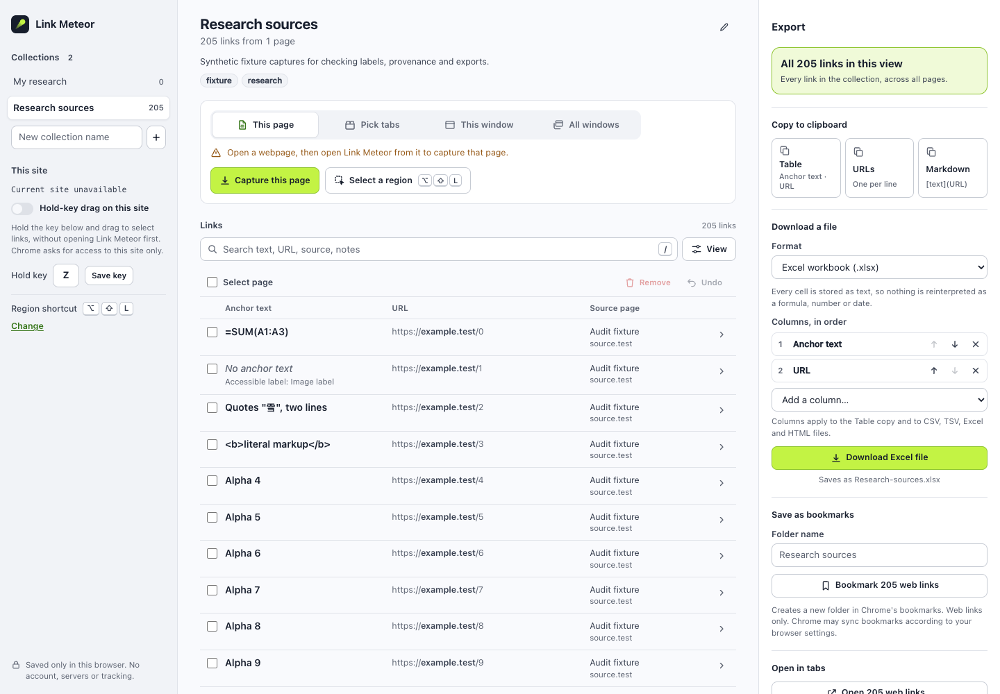
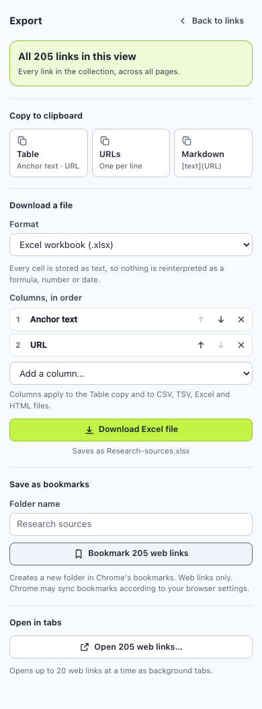

# Link Meteor — Astra audit handback

**Repairs are ready for review; final functional acceptance is blocked by the isolated browser’s permission prompts. I recommend waiting to merge or deploy.** No publication, PR merge, Pages setting change or workflow dispatch occurred.

The audit began at **2026-09-25 21:02:57 UTC** with a new six-hour clock. It is stopping early at a concrete testing blocker, not at the time limit. Closeout time and remote backup receipt appear below. The user-selected driver was Astra Xhigh; two bounded Sol workers assisted with source review and narrow repairs. Astra reviewed their changes and ran the acceptance checks.

## What was found and repaired

| Area | Observed problem | Repair and evidence |
| --- | --- | --- |
| Selection | Remove could delete a selected occurrence hidden by the current filter. | Remove now targets selected occurrences in the current view; hidden selection remains intact. Original defect reproduced, repaired packaged UI passes. |
| Keyboard | Checking an individual link or tab replaced its focused control. | Stable control identity restores focus. Link checkbox tested with Space; tab-checkbox repair reviewed statically, awaiting the tab-grant suite. |
| Capture batches | A report action survived switching collections, and an older batch could be called “latest.” | Report actions track the active collection; the filter reads “Selected capture.” Exact 105/205 filtering and later-batch/collection changes tested. |
| Regional saves | The overlay retained an old destination name, and overlapping Add/Review could save five links twice. | Destination refresh and the actual save receipt determine wording; concurrent saves share one request. Four targeted checks pass. |
| Site package | The old sync check could pass even when the downloadable ZIP was stale relative to capture/workbench source. | Verify all actual ZIP members, CRCs and bytes against every source file. Stale-source and corrupt-ZIP regressions pass. Old packages are retained. |
| Site semantics and claims | Excel preview exposed A/B as column headings; install text understated the owner’s report. | Anchor text/URL are semantic headers; the site distinguishes 0.2.0 human use from 0.2.1 automated checks and pending capture acceptance. |
| Deployment | A manual run could select a non-main branch. | Workflow remains manual only and now permits its deployment job only on main. Static review only; nothing was dispatched. |

The core data model and exporters, storage schema v1, permission set, capture geometry, and original link fields are unchanged by these repairs. No additional product feature was started. Existing collection data was checked through synthetic schema-v1 records and exact restart persistence; your everyday Chrome data was not accessed or changed.

## Identity and preservation

| Item | Verified identity |
| --- | --- |
| Original Opus handback head | `41f82e58066d57aa19c44b00dc8bb07c8cf81407` |
| Original tested product source | `7c9ca4a`; head source matched the original package |
| Comparison baseline | `a6dddac13b14307e6a343e78d540167c1232dc4b` |
| Audit branch | `codex/audit-0.2.0` |
| Repaired packaged product source | `e8e69cf734ed750ee6b792cc3cae1f9bf898ce62` — clean product files at packaging |
| New candidate | `artifacts/link-meteor-0.2.1.zip` — **193,346 bytes**, 13 files |
| New candidate SHA-256 | `231f454f60a7aba45ad6834b559268e1ddaabc66304ce55be4a9e783a7d219e9` |
| Original ZIP | 191,513 bytes; SHA-256 `1cb1b778a91180709455e273eb9b0f1cbefe758a6e43d01156729c14330fc197`, unchanged |

The [new ZIP](../../artifacts/link-meteor-0.2.1.zip) and its [per-file receipt](../../artifacts/link-meteor-0.2.1.sha256.json) are separate files. The site’s local development download points to that candidate; neither the site nor ZIP was published. Later audit commits contain tests, evidence, site metadata and this report; their product source remains identical to the packaged source above.

I verified Opus’s comparison claims directly: model.js, export.js and xlsx.js were byte-identical to the baseline; the manifest differed only by version; background.js added only the read-only collection.active handler. Capture scanning/geometry function regions were identical, and the full diff was reviewed as overlay presentation/destination/preview work. This is source review and byte comparison, not a formal semantic proof. See [SOURCE-COMPARISON.json](SOURCE-COMPARISON.json).

The protected `claude/design-v1` and `codex/chrome-v1` branches, main, annotated tag object and target, and [open draft PR #1](https://github.com/ryanjosephkamp/link-meteor/pull/1) remain unchanged. All 13 files in **artifacts/link-meteor-0.2.0/** still match the entry fingerprints. That folder was never used as the automation build and was never overwritten. See [PRESERVATION.json](PRESERVATION.json).

## What Astra actually checked

The loaded-browser checks used the installed **Chrome for Testing 151.0.7922.34 on macOS**, driven by Playwright, with task-owned profiles and extracted packaged bytes. They are automated Chromium evidence, not everyday-Chrome or native-prompt acceptance.

| Check | Result | Scope and limit |
| --- | --- | --- |
| npm test | **26/26 pass** | Pure model/export tests, simulated adverse API paths, UI permission-race simulations, and actual/stale/corrupt package checks. |
| Loaded workbench regressions | **7/7 pass** | Select all exports 205 rows; focus, hidden selection, batch behavior and original occurrence facts. Synthetic stored records, not captured webpage data. |
| Loaded action/persistence checks | **9/9 pass** | Collections, notes/tags, reversible grouping, Undo, preserved drafts, confirmed local opening, UI/background rejection of 21 links, missing-grant/closed-tab failures, exact restart persistence. |
| Packaged overlay component | **4/4 pass** | Real content code and messages/storage on an extension page. Destination/save/concurrency checks; does not establish ordinary-page injection or region geometry acceptance. |
| Seven exported formats | **Pass, 205 rows** | Independent Python reads: exact XLSX/CSV/TSV/HTML/JSON anchor/URL pairs, Markdown label normalization and URL-list fidelity. Formula-like label, literal markup, Unicode/newline and empty anchor preserved appropriately. |
| Workbook readers | **Pass** | openpyxl 3.1.5 and ZIP/OOXML; existing workbook edge-case fixture also passes. Microsoft Excel itself was not opened. |
| Extension presentation | **Pass** | 320/390/412/900/1440px bounds, compact views and long name; 22 sampled contrast pairs ≥5.1:1; named controls and focus ring. Not a screen-reader/WCAG certification or native side-panel test. |
| Local site | **Pass** | 50 page/width/theme cases; links, anchors, labels, contrast, keyboard menu, nested 404, demo drag/select-all and preview. No off-site requests observed. |
| Site spreadsheet | **Pass, 6 rows** | Actual preview download independently matches the six source anchors/URLs, including the empty anchor. |
| Site/source/package consistency | **Pass** | Actual ZIP contents match src; site ZIP, hash and copied export modules match the candidate. |

Evidence lives in [artifacts/audit-0.2.0](../../artifacts/audit-0.2.0/). The [acceptance map](../ACCEPTANCE.md) identifies each suite and its qualifications. Tests/design-preview.mjs and overlay-preview.mjs simulations were not used as acceptance. Opus’s historical receipts remain intact and are not counted as Astra’s reruns.

A screenshot retry initially reused a profile whose synthetic occurrence IDs already existed; the reducer correctly prevented reinserting those IDs. The diagnostic is retained. A fresh profile passed, and screenshots now capture the completed UI animation. This was a test setup issue, not a product repair.

## What remains blocked

**prepare-grants.mjs cannot finish the first optional tabs request.** The real API request starts inside an active user gesture, but remains pending; it returns neither a grant nor an error. The profile still has only required permissions. Headed attempts on the original package and a fresh repaired-package profile reproduced this; short headless diagnostics did not establish grants either. The final repaired-package attempt was bounded at 30 seconds and closed its own browser/server.

Native automation selected a different Chrome for Testing window, so I did not click a prompt in an unidentified window. No permission database, browser security setting, personal profile or credentials were changed. The reason for the unresolved request is **not established**; it is not being labeled an extension defect or a confirmed denial.

The requested **browser.mjs, extended-browser.mjs, site-browser.mjs and permission-browser.mjs were not run in this audit**, because their grant-preparation precondition was unmet. Therefore these remain outstanding on 0.2.1: ordinary-page regional geometry and capture scopes, practice-page answer keys, large capture, actual bookmarks, hold-key/revocation and clipboard reruns. Run permission-browser.mjs last after the other functional suites when grants are available.

The site worker reviewed the eight practice answer keys against the markup and scripts; Astra did not independently execute their captures. Opus’s successful 0.2.0 practice run is historical evidence only. Likewise, your report that 0.2.0 worked in everyday Chrome remains valuable human-use testimony with unitemized coverage, not proof for particular flows or for 0.2.1.

Still manual or unverified: native Allow/Deny, native side-panel sizing, everyday Chrome 0.2.1, real research/admin sites, Microsoft Excel, screen readers, Windows/Linux shortcuts, Chrome 116, real phones and deployed GitHub Pages. No unmeasured performance or broader compatibility claim is made.

## Implemented screenshots

These show the actual repaired workbench and local site, not design-preview mocks. Workbench records are synthetic fixture data. The narrow export view is a tab at panel width; it does not show Chrome’s native side-panel frame.






## Your installed build and next decision

Your loaded **0.2.0 installation is unchanged**. The 0.2.1 ZIP contains fixes, but reloading the unchanged 0.2.0 folder will not apply them. I recommend completing the blocked audit before replacing your everyday build.

For a later update, export collections first and preserve the existing unpacked path/extension identity. Without a fixed manifest key, an unpacked extension’s ID can derive from its path; a different folder can create a separate installation and separate storage. See [Chromium’s path-derived ID implementation](https://chromium.googlesource.com/chromium/src/+/lkgr/components/crx_file/id_util.h) and [Chrome’s consistent-ID documentation](https://developer.chrome.com/docs/extensions/reference/manifest/key). The agent has not altered your protected folder; any update there needs your explicit instruction or your own action. After its files are deliberately updated, Reload the extension and refresh source pages. Do not uninstall to update; version one has no import/restore flow.

**Whether and when to merge and deploy remains your decision.** My recommendation is to resume the outstanding checks first. The original draft PR does not contain these audit-branch repairs; a later integration decision must include them. I did not merge, retarget or modify that PR. No Pages workflow was run and no future run was scheduled.

## Execution and backup receipt

Report prepared **2026-09-25 21:28:06 UTC**, **25 minutes 9 seconds** after the recorded start. Source checkpoint `e8e69cf` was committed, pushed and independently matched to the remote audit branch. The complete artifact/evidence checkpoint and closeout will be committed and pushed on that same branch before handback; the final chat identifies the verified delivery tip. No protected branch or tag was moved. See [CLOSEOUT.json](CLOSEOUT.json), [LEDGER.md](LEDGER.md) and [resource checks](RESOURCES.json).

Workers: `/root/audit_workbench` requested and accepted **gpt-6-sol xhigh**; `/root/audit_site` requested and accepted **gpt-6-sol high**, both with no history fork or nested workers. They owned disjoint review/repair areas. Both completed; their writes were reconciled. Worker source claims, Astra’s actual checks and remaining human acceptance are separated above.

No new dependencies or browser downloads; project-local profiles/caches only. Project footprint measured about 182 MiB, including retained profiles and prior work (about 160 MiB in .scratch). The disk reached 97% capacity with about 16.2 GiB free; the much larger system-wide change is not attributed to this task. No peak-RAM measurement is claimed. All task browser/server contexts were closed; unrelated apps and sessions were not terminated.

## Exact next prompt

The HTML embeds the complete prompt below. Copy is assumed unavailable in mobile preview; the text remains readable. Clipboard behavior was not investigated.

```text
You are the Link Meteor driver; I select GPT-6 Astra Xhigh. Resume the blocked audit in /Users/noir/Documents/link-meteor, using only https://github.com/ryanjosephkamp/link-meteor. Read docs/audit-0.2.0/REPORT.md, LEDGER.md, START.json, PRESERVATION.json and docs/ACCEPTANCE.md before acting. Preserve the approved alignment and data contract. Reverify current files, instructions, Git state and remote; continue codex/audit-0.2.0 without overwriting intervening work.

The repaired candidate is artifacts/link-meteor-0.2.1.zip, 193346 bytes, SHA-256 231f454f60a7aba45ad6834b559268e1ddaabc66304ce55be4a9e783a7d219e9, packaged from clean product source e8e69cf734ed750ee6b792cc3cae1f9bf898ce62. Later audit commits contain its artifacts, site metadata, tests and evidence. Verify the actual ZIP against current src and its receipt. Do not repackage unchanged product code merely to change the recorded Git head.

Complete the outstanding grant-dependent checks on those exact bytes. Use tests/prepare-grants.mjs in a fresh task-owned Chrome for Testing profile, then tests/browser.mjs, extended-browser.mjs, site-browser.mjs and permission-browser.mjs last. The previous real optional tabs requests stayed pending despite an active user gesture; no native Allow/Deny acceptance was established. If assistance is needed to resolve the actual test-profile prompts, ask me once and pause dependent checks. Do not forge grants, edit permission databases, weaken browser security or use my everyday Chrome profile as the automated fixture. Keep automation-established grants distinct from observed native approval.

Independently read newly downloaded exports with tests/verify-downloads.py. Run other checks proportionately to any changes, including actual package/source consistency and local site claims. Preserve the existing passing checks and all failure diagnostics. Repair only concrete defects within the accepted product scope. Use at most two bounded Sol High/Xhigh or Luna High/Xhigh workers, no worker-spawned workers, if useful; Astra owns integration and acceptance. Record a new wall-clock timer for this resumed audit, with about six hours as the closeout limit, not a target.

Protect claude/design-v1, codex/chrome-v1, main, the opus-handback-2026-09-25 tag, and draft PR #1. Do not merge, close, retarget, rebase, amend or force-push those references. Do not write, delete, move or overwrite artifacts/link-meteor-0.2.0/, my unpacked everyday-Chrome installation. Keep new packages in new paths. Preserve unrelated sessions/apps/processes and repository history, delete nothing outside this project, keep resources modest, and install no heavyweight dependencies. Commit and push coherent audit checkpoints without force-pushing and verify the remote backup.

Do not deploy, enable Pages, dispatch its workflow, publish to the Chrome Web Store, make payments, alter account/security settings, request credentials, launch Claude Code, add features or ports, or schedule future runs. Whether and when to merge and deploy remains my decision after the audit. At completion or a concrete blocker, use /Users/noir/.codex/skills/render-mobile-html-report/SKILL.md for a standalone mobile-readable HTML handback, canonical Markdown and one exact readable next prompt. Include actual build/source identity, tests and limitations, elapsed time, branch/commit/push status and human decisions. Assume Copy does not work in mobile preview. Stop for my review.
```

