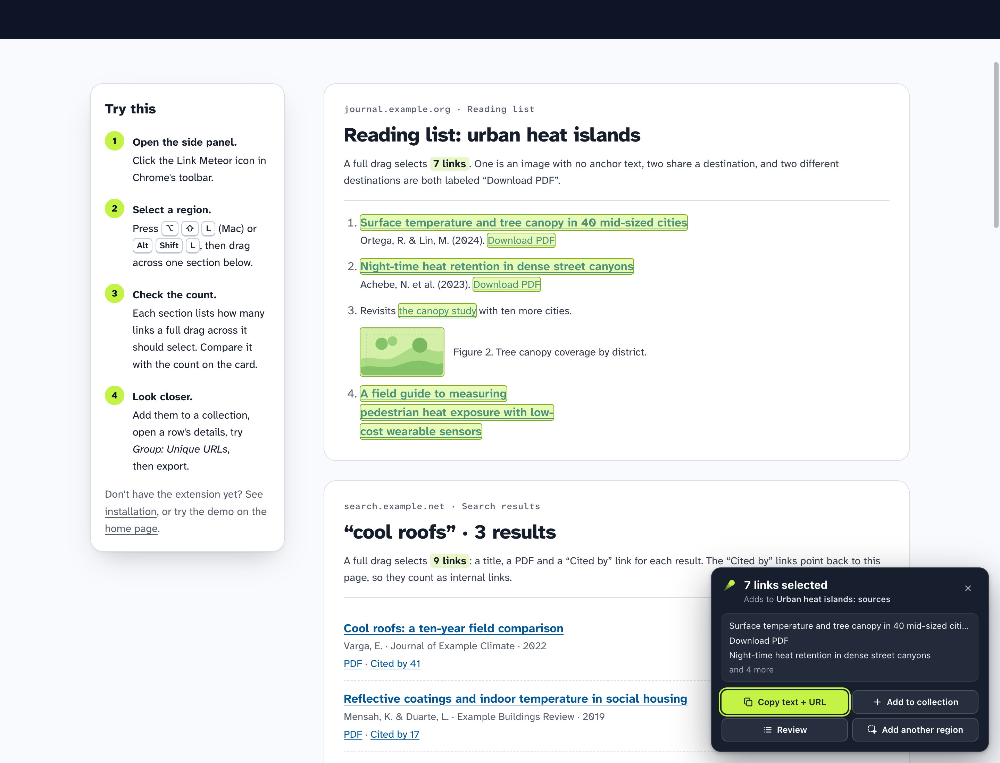
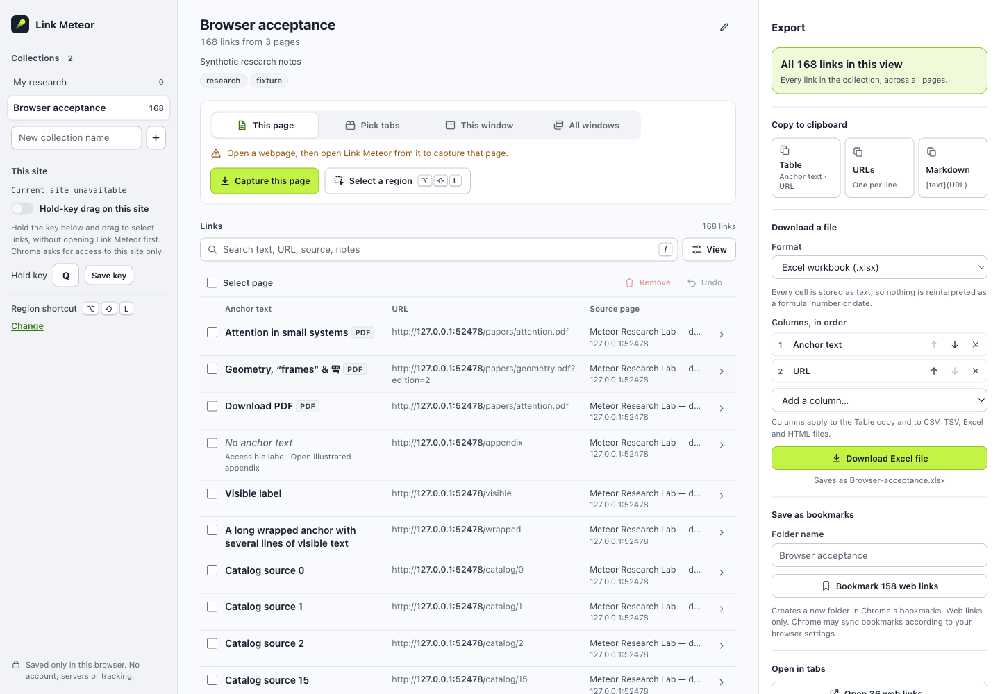
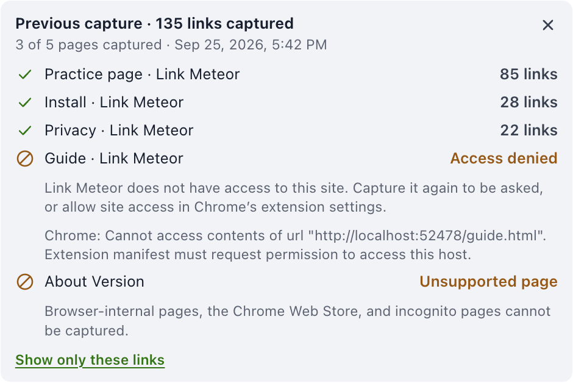

# Link Meteor — completed automated audit

**The previously blocked automated audit is complete. All required suites passed on the unchanged 0.2.1 package, with no blocking defect observed in the tested configuration.** The branch is ready for your review and integration decision. Nothing has been merged, deployed or published.

This is a new audit run, started **2026-09-25 at 21:37:50 UTC**. The six-hour clock was not inherited or reset. This pass needed no product repair, new package or worker dispatch; Astra ran the remaining checks sequentially. The final elapsed time and backup receipt appear below.

## The permission blocker cleared

The fresh task-owned profile was `.scratch/audit-021-resume-01`, using the verified extracted 0.2.1 package throughout. Its test tab was titled **Link Meteor audit — permission setup** to distinguish it from unrelated windows.

After I asked once for your help with the prompts, the real requests for tabs, the local `http://127.0.0.1:52478/*` fixture origin and bookmarks all resolved successfully. Each request logged an active user gesture and `granted: true`. The full grant setup completed at **21:40:00 UTC**. The earlier unresolved requests and diagnostics remain preserved.

At report preparation, no reply confirming who clicked had arrived. I therefore record **successful grants in the automated profile, with the native approval mechanism unclassified**. Astra did not independently observe an Allow/Deny click. No grant was forged, no permission database was edited, and no browser security setting or everyday Chrome profile was changed. This distinction does not prevent verifying the subsequent real capture and revocation behavior.

## Newly executed checks

All extension suites used installed **Chrome for Testing 151.0.7922.34 on macOS**, driven by Playwright, with the actual packaged extension loaded. These are automated Chromium checks, distinct from direct native-UI observations and from your everyday-Chrome report.

| Check | Result | What it establishes |
| --- | --- | --- |
| prepare-grants.mjs | **Pass** | The product's own optional-permission request paths established the three required test grants. |
| browser.mjs | **27/27 pass** | Faithful separate text/URL fields; wrapped-line, scrolling and frame geometry; exact five-link region; current/selected/window/all-window scopes; partial failures; collections, filtering and Undo; clipboard paste; seven downloads; exact browser/worker restart persistence. |
| extended-browser.mjs | **8/8 pass** | 5,037 loaded-page occurrences, bounded rendering and complete export; actual bookmark titles/URLs; inline opening confirmation and cap; grouped details and draft preservation. |
| site-browser.mjs | **Pass** | All eight practice answer keys, whole-page capture and field/provenance checks; a mixed report retains successful captures and distinguishes denied and unsupported tabs. |
| audit-granted-regressions.mjs | **4/4 pass** | Keyboard tab-selection focus; regional destination refresh on an ordinary webpage; concurrent Add/Review saves once with the actual destination and provenance; saved receipt remains stable after switching collections. |
| verify-downloads.py | **Pass: 53 rows** | Independent reads of newly downloaded XLSX, CSV, TSV, HTML and JSON match exact anchor/URL pairs. Markdown preserves the specified single-line label representation; the URL list matches exactly. |
| permission-browser.mjs — run last | **3/3 pass** | Actual fixture-origin revocation removes hold settings and script registration, stops the gesture on an already loaded page, and makes later capture report denied rather than successful zero. |
| Site/source/package consistency | **Pass** | All 13 ZIP members match the source and receipt; the site's ZIP, hash and copied modules remain synchronized. |

The captured exports include **two empty anchors and one formula-like label**. XLSX cells are stored as strings and were read with **openpyxl 3.1.5**; Microsoft Excel itself was not used. The actual CSV/TSV files retain their original CRLF bytes. Captures made later in the suite mean the final workbench screenshot has more rows than the 53-row export snapshot; these are different recorded stages of the same run.

The large-capture observation was **700 ms** from triggering capture to the bounded row view in this one synthetic run. It is not a performance guarantee or a memory benchmark. The concurrency regression deliberately dispatches two DOM clicks in one event-loop turn; it uses the real ordinary-page content script, background messaging and storage with no API stubs.

The practice counts matched exactly:

| Reading | Results | Tickets | Products | Tricky labels | Scrolling archive | Same-origin frame | Shadow/late-loaded |
| --- | --- | --- | --- | --- | --- | --- | --- |
| 7 | 9 | 10 | 12 | 7 | 15 | 3 | 5 |

Whole-page practice capture found **85 links**. Empty image anchors retain a separate accessible label; formula and markup labels stay text; hidden/script links are excluded; frame and shadow-root provenance is retained. The mixed five-tab report produced success, success, success, denied and unsupported.

The earlier **26 Node tests, 20 targeted checks, visual checks and 50 local-site layout cases** remain applicable to identical product bytes. They were not relabeled as new reruns. Worker reports and design/overlay-preview simulations remain separate evidence. See the [complete acceptance map](../../ACCEPTANCE.md), [new evidence summary](../../../artifacts/audit-0.2.0/resume-01/SUMMARY.json) and [first audit report](../REPORT.md) for the repair history and earlier qualifications.

## Actual implemented views

These images come from this resumed audit, not design mocks. Browser controls and Chrome's native side-panel frame are outside these page screenshots.







## Source, build and preservation

| Item | Identity |
| --- | --- |
| Working branch | `codex/audit-0.2.0` |
| Entry commit | `7ce68674dcf04f714831948e49706fac909f43d6` |
| Tested product source | `e8e69cf734ed750ee6b792cc3cae1f9bf898ce62` |
| Unchanged ZIP | [link-meteor-0.2.1.zip](../../../artifacts/link-meteor-0.2.1.zip), **193,346 bytes**, 13 files |
| SHA-256 | `231f454f60a7aba45ad6834b559268e1ddaabc66304ce55be4a9e783a7d219e9` |
| Passing evidence checkpoint | [`20699de291d31554c0de2e55b8ab9e4609216fa8`](https://github.com/ryanjosephkamp/link-meteor/commit/20699de291d31554c0de2e55b8ab9e4609216fa8), pushed and remote SHA matched |

The source and package are identical to the candidate you approved for this audit. No version bump or repackaging was needed. Changes in this pass are tests/evidence and documentation: the test tab's identifying title, a direct regression check, precise revocation evidence wording, and the README/install/acceptance text that previously said testing was pending.

The protected branches, main, annotated tag and [draft PR #1](https://github.com/ryanjosephkamp/link-meteor/pull/1) remain unchanged. Your **artifacts/link-meteor-0.2.0/** folder and all 13 entry fingerprints are preserved; the original ZIP is unchanged. See [START.json](START.json) and the final [preservation receipt](PRESERVATION.json). No other repository was modified.

## What remains your decision

**The audit no longer has an automated functional blocker.** Whether and when to integrate the audit branch and deploy the site is your decision. The original draft PR contains Opus's work but not the later audit repairs; the integration route needs to include both. No PR was merged, closed or retargeted, and the Pages workflow was not run or enabled. The public-site source still offers the free development ZIP as requested.

Your everyday installation remains **0.2.0**. This pass did not update or reload it. The existing 0.2.1 ZIP is ready for a deliberate update after your review; reloading an unchanged 0.2.0 folder does not install the new files. Preserve the installation's path/identity and export collections before updating. The [previous handback](../REPORT.md) explains the storage/identity consideration; no import/restore feature exists in version one.

Still unverified or human-dependent: native Allow/Deny and side-panel interaction; everyday Chrome **0.2.1** on your real research/admin sites; Microsoft Excel; assistive technology; Windows/Linux shortcuts; Chrome 116; real phones and a deployed GitHub Pages site. Your unitemized report that 0.2.0 worked in everyday Chrome remains separate. Declared support and automated spot checks do not establish those environments. Chrome Web Store review/publication, payments, ports and AI features remain outside this task.

The exact next prompt prepares a concrete integration/publication proposal for your approval; it does not authorize publishing.

## Closeout

Closeout recorded **2026-09-25 21:53:41 UTC**, **15 minutes 51 seconds** after the new start. The passing evidence checkpoint `20699de` was committed, pushed and independently matched to the remote. Final handback files are a later documentation/test-evidence commit on the same audit branch, with unchanged product source. The accompanying chat reports the final verified delivery tip. See [CLOSEOUT.json](CLOSEOUT.json) and [LEDGER.md](LEDGER.md).

The report passed 320/390/412/1440px checks with and without JavaScript, exact prompt parity and three decoded embedded images, with no remote requests. Updated install wording passed six width/theme checks. Actual mobile preview and Copy were not tested.

No new workers were dispatched; the two prior Sol workers remained completed. All extension test browsers and fixture servers closed their own contexts. The task-owned origin was deliberately revoked by the final extension suite; that profile should not be reused for capture without fresh grant preparation. No unrelated process or app was terminated, and no future run was scheduled.

The project measured about **218 MiB**, including about **186 MiB** of retained scratch data and prior work; this pass's new evidence was about **3.6 MiB** before report generation. The disk was about **97% full**, with **16.7 GiB free**. No runtimes, dependencies, browser binaries or fonts were downloaded. Peak RAM was not measured.

## Exact next prompt

Copy is assumed unavailable in mobile preview. The complete prompt remains readable; clipboard behavior was not investigated.

```text
You are the Link Meteor driver; I select GPT-6 Astra Xhigh. I have reviewed the completed automated audit. Prepare a concrete integration and publication proposal for my decision, working only in /Users/noir/Documents/link-meteor and https://github.com/ryanjosephkamp/link-meteor.

Read docs/audit-0.2.0/resume-01/REPORT.md, its ledger and preservation/closeout receipts, docs/ACCEPTANCE.md, the approved ALIGNMENT.md, docs/CONTRACTS.md and site/README.md. Reverify current files, instructions, Git state, remote refs and draft PR #1; preserve intervening work. The tested build is the unchanged 193346-byte artifacts/link-meteor-0.2.1.zip, SHA-256 231f454f60a7aba45ad6834b559268e1ddaabc66304ce55be4a9e783a7d219e9, from product source e8e69cf734ed750ee6b792cc3cae1f9bf898ce62. The completed audit evidence was backed up at 20699de291d31554c0de2e55b8ab9e4609216fa8; later commits on codex/audit-0.2.0 contain the final handback.

Show the exact commits and proposed integration route that includes both Opus's work and Astra's audit repairs, how the original draft PR would be handled, the proposed manual GitHub Pages deployment sequence and its prerequisites, and remaining human checks before Chrome Web Store publication. Include a safe user-controlled update path from my existing unpacked 0.2.0 installation that preserves extension identity and collections. Keep the development ZIP offering and all features free.

This prompt authorizes preparation only. Do not merge, close or retarget PRs; do not move main, claude/design-v1, codex/chrome-v1 or opus-handback-2026-09-25; do not deploy, enable Pages, dispatch workflows, publish to the Store, make payments, change account/security settings or request credentials. Do not write or overwrite artifacts/link-meteor-0.2.0/. Do not repackage unchanged source. Preserve unrelated sessions/apps/processes, delete nothing outside this project, use modest resources and add no product features, ports or AI work. Do not launch Claude Code or schedule future runs.

Complete the reviewable proposal before asking for the final publication authorization. Use /Users/noir/.codex/skills/render-mobile-html-report/SKILL.md for standalone mobile-readable HTML, canonical Markdown and one exact readable next prompt reflecting the concrete proposal. Assume Copy does not work in mobile preview. Stop for my review.
```
