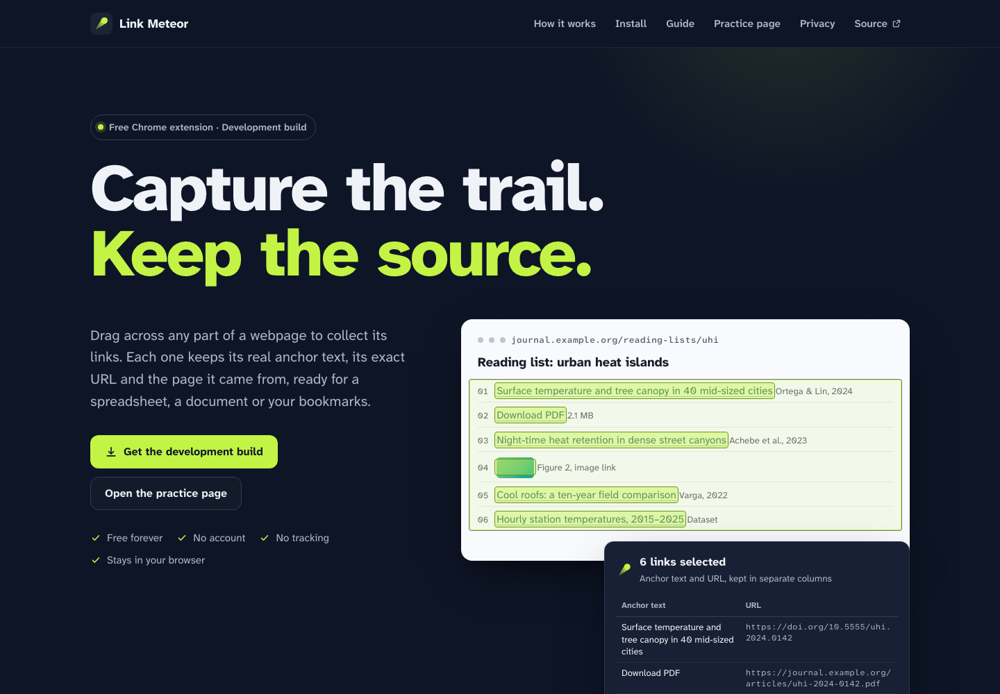
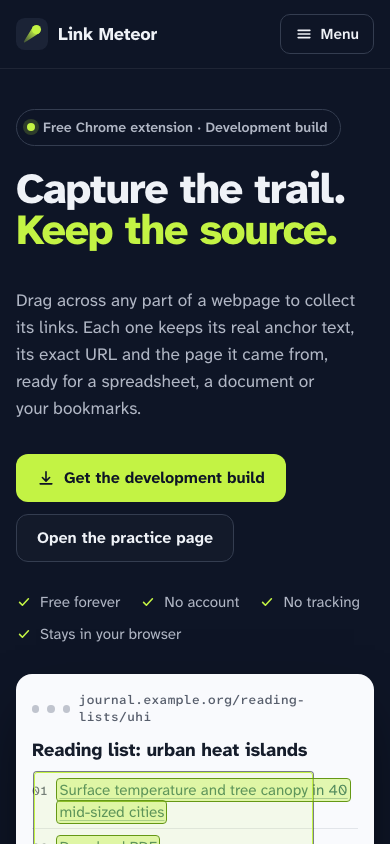
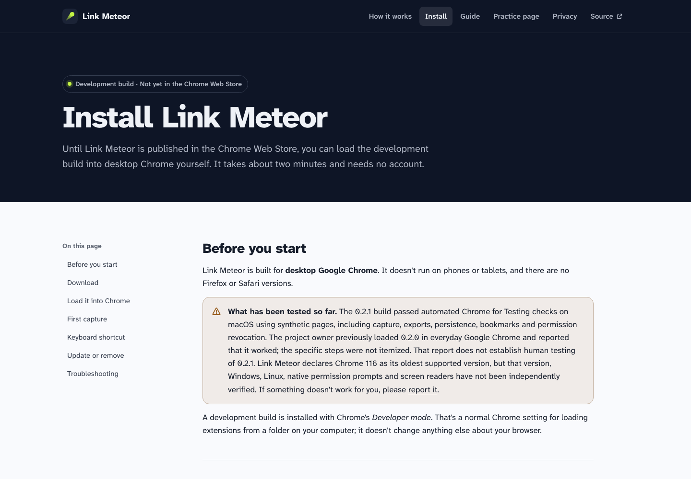

# Link Meteor is live

**The approved integration and first website publication are complete.** Link Meteor's primary distribution route is now the free ZIP download, extraction, and Chrome's **Load unpacked** flow. All browser-store work is deferred by your choice; no registration, upload, submission or payment occurred.

- [Open Link Meteor](https://ryanjosephkamp.github.io/link-meteor/)
- [Download and installation instructions](https://ryanjosephkamp.github.io/link-meteor/install.html)
- [Download the verified 0.2.1 ZIP](https://ryanjosephkamp.github.io/link-meteor/downloads/link-meteor-0.2.1.zip)
- [Practice page](https://ryanjosephkamp.github.io/link-meteor/practice.html) · [Guide](https://ryanjosephkamp.github.io/link-meteor/guide.html) · [Privacy](https://ryanjosephkamp.github.io/link-meteor/privacy.html)

The existing site already provides the requested ZIP installation route, so the exact approved snapshot was published without product, website or workflow edits. It remains honestly labeled a development build. The extension, every feature and the downloadable package remain free, with no account, ads, telemetry, hosted backend dependency or paid tier.

## What was integrated and published

| Item | Verified identity/result |
| --- | --- |
| Integration PR | [#2 — Integrate audited Link Meteor 0.2.1 and development website](https://github.com/ryanjosephkamp/link-meteor/pull/2), merged with a merge commit |
| Approved release branch | `codex/release-0.2.1` at `696620091f7a92d3814e390582942c5f5db926b7`; retained |
| Main / deployed source | `ee3148ec584c51e49438bed097ffb70c9d9a6603` |
| Merge parents | `9efb43350a0115c15b059b428f7cc8bffcbd59b1` and `696620091f7a92d3814e390582942c5f5db926b7` |
| Integrated tree | `9b013c80026ab6b28ce2a70da33c49cb05fa1695`, identical to the approved snapshot; all 13 original commits retained |
| Pages run | [36196516959](https://github.com/ryanjosephkamp/link-meteor/actions/runs/36196516959), **success**, on the exact merge above |
| Dispatch count | **One**; no retries, reruns or scheduled continuation |
| Artifact published | Exactly **37 files**, byte-for-byte equal to `site/`; no repository-root files, source tree, profiles or audit reports in the Pages artifact |
| Product source | `e8e69cf734ed750ee6b792cc3cae1f9bf898ce62`; unchanged, no repackaging |
| Public ZIP | `link-meteor-0.2.1.zip`, **193,346 bytes**, 13 files |
| SHA-256 | `231f454f60a7aba45ad6834b559268e1ddaabc66304ce55be4a9e783a7d219e9` |

I independently downloaded the **public HTTPS ZIP** and verified its size, hash and every member against the audited package and `src/`. The deployment artifact was also downloaded and its full file set/hashes compared with `site/`. Evidence: [merge receipt](MERGE.json), [workflow receipt](RUN.json), [artifact verification](artifact-verification.json), [public download verification](live-download.json).

Pages is configured with GitHub Actions as its source, and HTTPS is enforced. GitHub created its default `github-pages` environment with a main-only deployment branch policy; no protection was weakened. All action steps succeeded, including Node setup, source/package consistency verification, upload and deployment. Only this repository's approved Pages configuration changed; no other account or security settings were modified.

## Protected work and original PR

GitHub automatically marked [PR #1](https://github.com/ryanjosephkamp/link-meteor/pull/1) **merged indirectly** when its original commits entered main through PR #2. I did not directly merge, close, edit or retarget it. This is the consequence explicitly approved in the execution prompt.

The original branches and annotated tag remain at their original identities:

| Protected reference | Unchanged value |
| --- | --- |
| `claude/design-v1` | `41f82e58066d57aa19c44b00dc8bb07c8cf81407` |
| `codex/chrome-v1` | `499c3ab1551a09338529f9f7ecabbf5c3048df38` |
| `opus-handback-2026-09-25` tag object | `91811fe331616b4aaaef502d4dcade5f24aca9a1` |
| Tag target | `41f82e58066d57aa19c44b00dc8bb07c8cf81407` |

Your **artifacts/link-meteor-0.2.0/** installation and its 13 fingerprints are unchanged. I did not access personal collections, operate your everyday Chrome profile, update/reload your installation, delete branches, rewrite history or change another repository. Main advanced only through the authorized integration merge.

The local checkout returned to `codex/audit-0.2.0` for evidence and this handback. Checkpoint **0f4289ced367291e49a5ad6f7b0ba9a104cf3dcf** saved the verified merge and dispatch receipts; its remote SHA matched. The final delivery commit is reported in the accompanying chat. These later evidence commits are not additional deployments.

## Checks actually executed this turn

| Check | Result and scope |
| --- | --- |
| Exact approved snapshot | Clean release branch at 6966200; head/base and merge prerequisites checked before merging; merge parents/tree and original ancestry checked afterward. |
| `npm test` | **26/26 pass** on the approved snapshot. The adverse Chrome-API cases remain explicitly simulated tests. |
| `node scripts/sync-site.mjs --check` | Pass locally and in the hosted deployment job; actual ZIP/source members, metadata and copied export modules agree. |
| Live pages | **50 page/width/theme cases pass**: home, install, guide, privacy and practice; 320/390/768/1024/1440px, light/dark. No horizontal overflow, failed/off-site page requests or JavaScript problems recorded. |
| Live navigation and assets | Internal links/anchors, page structure, accessible control names and sampled contrast passed; nested missing path returned the styled custom 404; mobile menu worked by keyboard and Escape. |
| Live home demo | Drag selected exactly two example links; Select all selected six; CSV/Markdown/XLSX previews and arrow-key export tabs worked. This is the website demo, not loaded-extension capture. |
| Live demo XLSX | Downloaded workbook independently read with openpyxl 3.1.5: all six anchor/URL pairs match, including an empty anchor; cells are strings. Not Microsoft Excel application acceptance. |
| Public release ZIP | Exact expected size/hash and all 13 source members. No new package was created. |
| Deployed artifact | All 37 file hashes match `site/`, with no extra files. |

Live site evidence is under [artifacts/publication/2026-09-25](../../../artifacts/publication/2026-09-25/site-results.json). The live harness is retained as `tests/publication-live.mjs`; it adapts the existing site suite's origin, server, evidence and temporary paths. The full extension suites were not rerun here: their unchanged-byte acceptance remains in [the completed audit](../../audit-0.2.0/resume-01/REPORT.md) and [ACCEPTANCE.md](../../ACCEPTANCE.md).

Native Allow/Deny observation, ordinary Chrome 0.2.1 usage, native side-panel behavior, Microsoft Excel, assistive technology, other operating systems and declared Chrome 116 support remain limited as previously reported. A real phone or non-Chromium browser was not used for the website. These are useful manual checks, not an instruction to restart browser-store work.

## Screenshots of the live website

These screenshots were captured from the deployed HTTPS site in a task-owned automated browser. The homepage's illustrated capture area is its interactive demo; it is not evidence of a newly loaded extension run.







## Installing from the ZIP

Yes: on desktop Chrome, extract the ZIP into a folder you will keep, open `chrome://extensions`, enable **Developer mode**, choose **Load unpacked**, and select the folder containing `manifest.json`. The live install page provides these steps and the exact download hash. Keep that folder in place; updates use new files in the same folder followed by reloading the extension and affected webpages. [Chrome's installation and reload documentation](https://developer.chrome.com/docs/extensions/get-started/tutorial/hello-world).

This is a manual installation and update route; it does not provide Store auto-updates. Chrome mobile is not an extension target for this release. The website's narrow-width checks concern reading the site, not installing the extension on a phone.

**For your existing 0.2.0 installation, use the preservation-first instructions already prepared in the [publication proposal](../../publication-proposal/2026-09-25/REPORT.md).** Back up the collections and code, retain the original path and extension entry/ID, then replace code in place and reload only when you choose. A collection JSON export is not a complete application backup, and version one has no import/restore flow. Your installation was not changed by publishing the website.

## Closeout and next action

The new timer began **September 25, 2026 at 22:20:18 UTC**. Deployment completed at **22:25:04 UTC**, with one successful dispatch. Closeout checks finished **11 minutes 51 seconds** after the new start; final backup follows. Preservation and timing receipts are in [CLOSEOUT.json](CLOSEOUT.json) and [PRESERVATION.json](PRESERVATION.json). No workers, dependency installations, browser downloads or unrelated process termination were needed. One task-owned browser ran the live checks and closed normally; report validation uses another short-lived isolated browser. No personal browser profile was used and no future run was scheduled.

The report passed 320/390/412/1440px checks with and without JavaScript, exact prompt parity, local-link checks and decoding of all three embedded images, with no remote requests. Results are in [VALIDATION.json](VALIDATION.json). Copy/mobile-preview behavior is intentionally untested. Historical documents describing future Store steps or an undeployed site remain historical; this handback records the current publication state and supersedes their next-action guidance. **Browser stores stay deferred unless you explicitly change that decision.**

The next useful step is your optional manual review of the live site and 0.2.1 extension. The prompt below starts a guided session while leaving installation actions under your control; it does not authorize another deployment or store work.

## Exact next prompt

Copy is assumed unavailable in mobile preview. The complete prompt remains readable.

```text
You are the Link Meteor driver; I select GPT-6 Astra Xhigh. I have reviewed the published website and the handback in docs/publication/2026-09-25/REPORT.md. Help me complete a short, user-controlled manual acceptance session for the ZIP-distributed Chrome extension. Browser stores remain deferred: do not prepare store uploads, register accounts, request credentials, make payments or submit anything.

Work only in /Users/noir/Documents/link-meteor and https://github.com/ryanjosephkamp/link-meteor. First read the publication handback and receipts, docs/ACCEPTANCE.md, the approved alignment and docs/CONTRACTS.md. Reverify Git state and package identity. The website was deployed by run 36196516959 from merge ee3148ec584c51e49438bed097ffb70c9d9a6603. The 0.2.1 ZIP is 193346 bytes with SHA-256 231f454f60a7aba45ad6834b559268e1ddaabc66304ce55be4a9e783a7d219e9, packaged from source e8e69cf734ed750ee6b792cc3cae1f9bf898ce62.

Start by asking whether I have already updated the installed extension to 0.2.1. If I am still on 0.2.0, guide me through the same-path backup and manual update instructions in docs/publication-proposal/2026-09-25/REPORT.md. I will operate Chrome and perform installation changes myself. Do not read my personal collection data, operate my everyday Chrome profile, write or overwrite artifacts/link-meteor-0.2.0/, remove the extension, move its folder, clear storage or change its identity. Explain that JSON link exports are not a full app backup and that version one has no import/restore flow. Do not ask me to paste private URLs or raw storage into chat.

Guide a few focused checks: version and unchanged extension ID; collection counts/notes after reload; region capture and faithful separate text/URL fields on the public practice page and a real page of my choice; native side-panel/shortcut behavior; export opening in Excel if available. Record my observations as user-reported human evidence, separate from prior automation. Permission Allow/Deny checks, if needed, should use a disposable manual test profile rather than revoking everyday-profile access.

Do not merge or deploy again, dispatch any workflow, alter protected refs, change product features/permissions/storage, launch Claude Code, begin ports or AI work, or schedule follow-ups. Preserve all unrelated work and processes. If feedback identifies a concrete defect, document a bounded repair proposal before making product changes. Save a concise mobile-readable HTML/Markdown handback using /Users/noir/.codex/skills/render-mobile-html-report/SKILL.md with one exact readable next prompt. Assume Copy does not work in mobile preview. Stop for my review.
```
